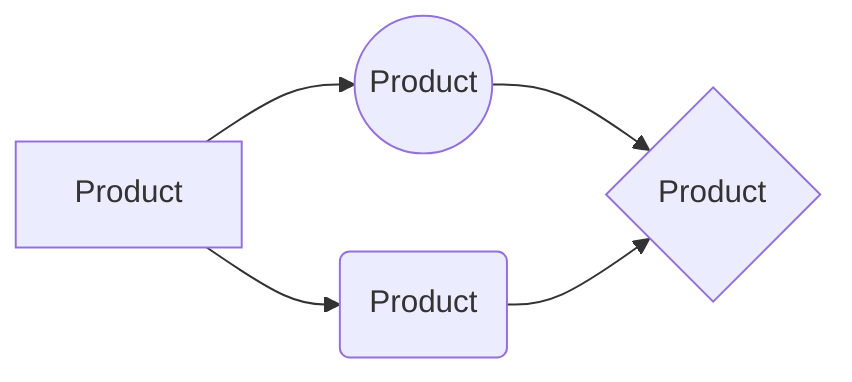

# DB EXAM

## Table of Contents

- [TODO](#todo)
-  [Инициализация базы](#1-инициализация-базы)


## 1 Инициализация базы
```
	image: postgres:latest
```

```
	environment:
		POSTGRES_DB: db
		POSTGRES_USER: postgres
		POSTGRES_PASSWORD: postgres
```

```
	environment:
		-DATABASE_URL=postgresql://postgres:postgres@db:5432/db
```

```
	ports:
		- "5432:5432" 
```  


## 2

## 3

## 4

## 5

## 6

## 7

## 8

## 9


# TODO

1. [ ] **5 баллов** — написать скрипт инициализации базы (создание базы данных с определенным именем, установка владельца базы)

2. [ ] **15 баллов** — продумать REST API в зависимости от темы и написать программу, реализующую базовый CRUD

3. [ ] **15 баллов** - заполнить бд большим количеством данных с помощью скрипта, который взаимодействует с бд через REST API вашего приложения

4. [ ] **10 баллов** — создать и добавить хотя бы 2 миграции данных (добавление новых колонок и построение индексов при помощи миграций)

5.  [ ]  **25 баллов** - составить следующие разновидности запросов, подходящих для вашей темы и реализовать их в виде вызовов REST API (по 5 баллов каждый):
— SELECT ... WHERE (с несколькими условиями)
— JOIN
— UPDATE с нетривиальным условием
— GROUP BY
— добавить к параметрам запросов в API сортировку выдачи результатов по какому-то из полей

6. [ ] **20 баллов** — создать JSON-поле, наполнить его данными, построить над ним pg_trgm + GIN индекс, реализовать полнотекстовый поиск по регулярному выражению из синтаксиса psql в виде REST API запроса

7. [ ] **10 баллов** - использование ORM

8. [ ] **10 баллов** - использование пагинации

9. [ ] **10 баллов** - создать простенький ui


# Templates

**Bold text**

> Note.
- Bullet points 
[Link](https://github.com/Miqooo/db_exam)

|                |Column1	|Column2|
|----------------|-------------------------------|-----------------------------|
|Row1|`'value1'`            |'value2?'            |
|Row2|


### UML diagrams
